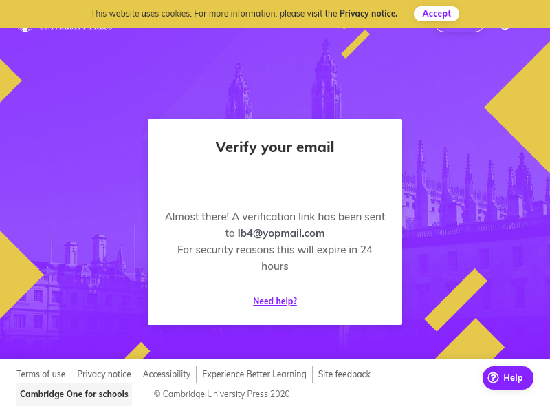

# puppeter
create learner:
node puppeter-learner.js {{username}}

create teacher
node puppeter-teacher.js {{username}}

where username can be 'lb1' to create user 'lb1@yopmail.com'

# Testing
verify to created user in pics directory

